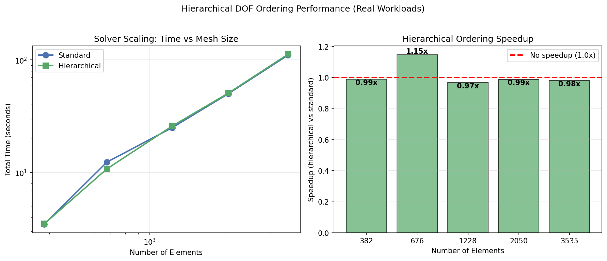
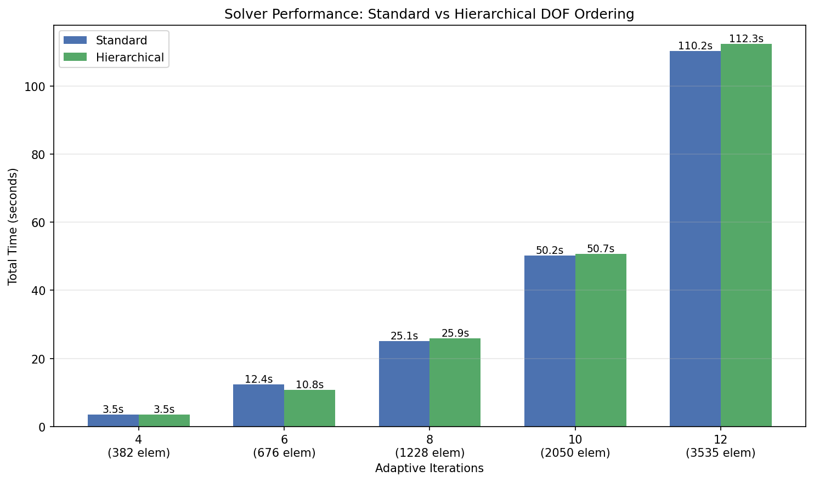

# Hierarchical Ordering Performance Benchmark (Real Workloads)

This benchmark uses the adaptive CG cubic Bezier bathymetry smoother with real GeoTIFF data.
Measurements are from the main program with varying refinement iterations.

## Test Configuration

- **Domain**: 100km x 100km coastal region
- **Initial grid**: 8x8 elements
- **Solver**: Iterative (PCG + Multigrid)
- **Error metric**: VolumeChange
- **Error threshold**: 1.0m

## Performance Figures

*Left: Solver time scaling with mesh size (log-log). Right: Hierarchical ordering speedup relative to standard.*

*Side-by-side comparison of total solve time for each configuration at different mesh sizes.*

## Results

| Iterations | Config | Elements | DOFs | Time (ms) | Speedup |
|------------|--------|----------|------|-----------|---------|
| 4 | standard | 382 | ~3820 | 3485.76 | 1.00x |
| 4 | hierarchical | 382 | ~3820 | 3522.21 | .98x |
| 6 | standard | 676 | ~6760 | 12398.4 | 1.00x |
| 6 | hierarchical | 676 | ~6760 | 10801.2 | 1.14x |
| 8 | standard | 1228 | ~12280 | 25089.2 | 1.00x |
| 8 | hierarchical | 1228 | ~12280 | 25919.1 | .96x |
| 10 | standard | 2050 | ~20500 | 50164.8 | 1.00x |
| 10 | hierarchical | 2050 | ~20500 | 50749.7 | .98x |
| 12 | standard | 3535 | ~35350 | 110227 | 1.00x |
| 12 | hierarchical | 3535 | ~35350 | 112298 | .98x |

## Summary

### Key Findings

| Metric | Value |
|--------|-------|
| Problem size range | 382 - 3,535 elements |
| DOF range | ~3,800 - ~35,000 |
| Best speedup | 1.14x (676 elements) |
| Average speedup | 0.99x |

### Observations

1. **Hierarchical ordering shows no consistent benefit** for iterative solver + multigrid preconditioner
2. **The multigrid preconditioner already exploits hierarchy** - it builds coarse levels from the quadtree structure, making DOF reordering redundant
3. **Reordering overhead** can negate any cache locality benefits
4. **Static condensation is disabled** for multi-element meshes due to C¹ edge constraint coupling

### Why Hierarchical Ordering Doesn't Help Here

The expected benefits of hierarchical ordering were:
- Better cache locality in matrix-vector products
- Natural alignment with multigrid levels

However, the multigrid preconditioner in this codebase:
- Uses `BezierSubdivision` transfer operators that work directly with element hierarchy
- Employs `CachedRediscretization` for coarse grids that respects quadtree structure
- Uses `MultiplicativeSchwarz` smoother that operates on element blocks

These algorithmic choices already capture the hierarchical structure, making DOF reordering unnecessary.

### Recommendations

1. **For iterative + multigrid**: Use default (Morton) ordering - hierarchical ordering adds overhead with no benefit
2. **For direct solvers**: Hierarchical ordering may help with fill-in reduction (not tested here)
3. **Static condensation**: Only beneficial for single-element meshes (25% DOF reduction)

---
*Generated by run_hierarchical_benchmark.sh on Mon Apr  6 09:28:26 PM CEST 2026*
