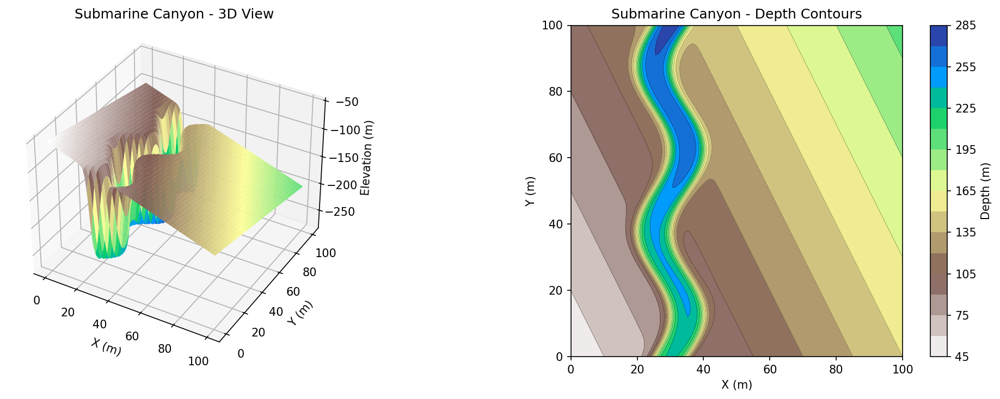
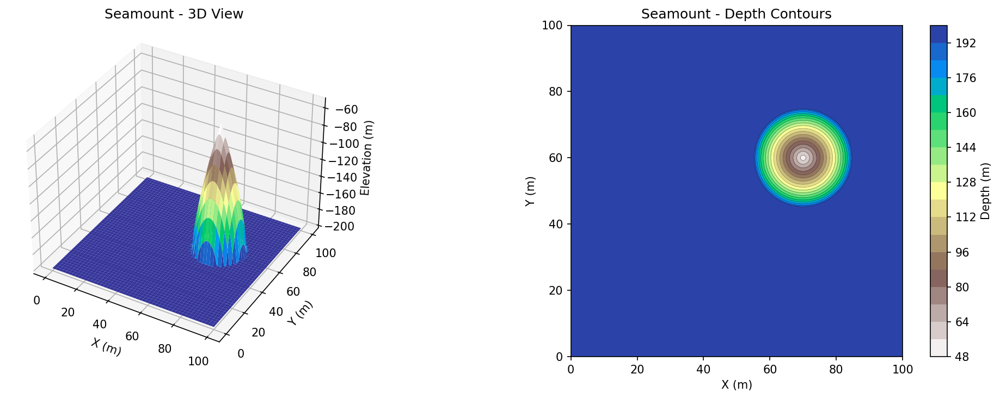
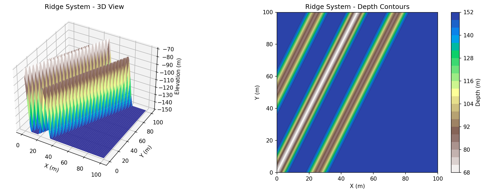
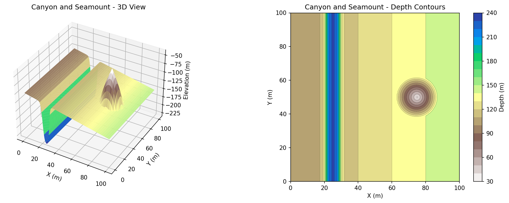
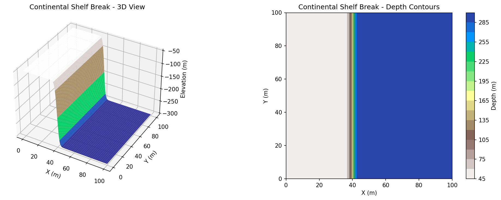
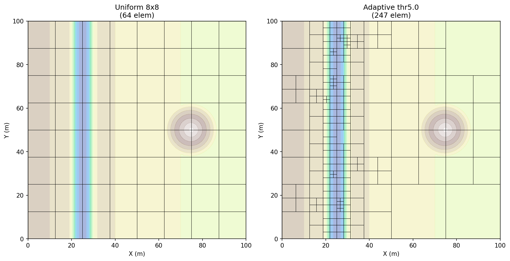
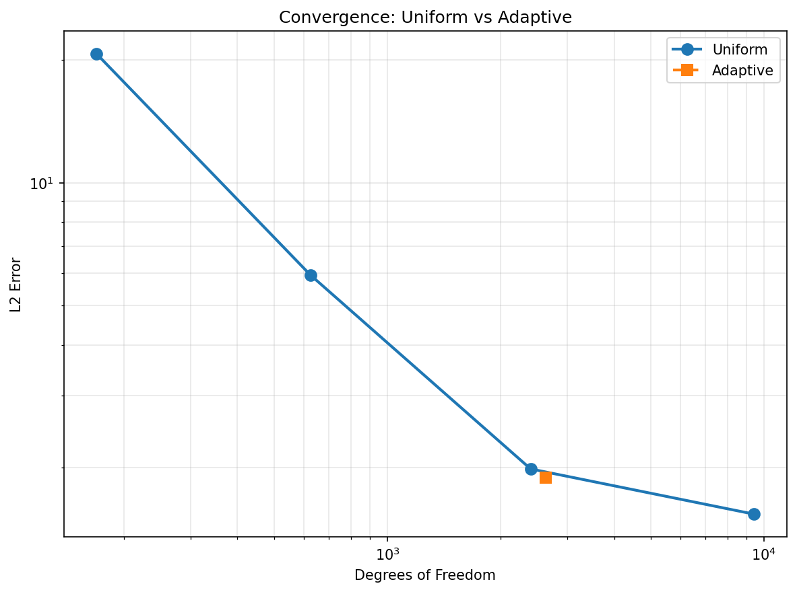

# Uniform vs Adaptive Grid Convergence Study

This report compares convergence and computational performance of uniform grids versus adaptive mesh refinement (AMR) for bathymetry fitting using CG cubic Bezier surfaces.

## Synthetic Bathymetry Test Cases

We define five synthetic bathymetry functions with localized features that challenge uniform grids. Each function is defined on a 100m x 100m domain.

### 1. Submarine Canyon

A steep-walled canyon cutting across the domain with sinusoidal variation in position. The canyon walls have a tanh profile with high steepness parameter (50), creating sharp transitions that require fine resolution to capture accurately.



### 2. Seamount

An isolated underwater mountain with a conical shape and rounded top. Located at (70m, 60m) with radius 15m and height 150m. The localized nature makes this ideal for adaptive refinement.



### 3. Ridge System

Three parallel ridges running diagonally across the domain. Each ridge has a cosine-squared cross-section profile. The central ridge is tallest (80m), with flanking ridges at 80% height.



### 4. Canyon and Seamount (Combined)

The most challenging test case combining:
- A steep canyon on the left side (x = 0.25)
- A seamount on the right side (x = 0.75, y = 0.5)
- A gentle background slope

This tests the ability of adaptive methods to concentrate refinement at multiple distinct features.



### 5. Continental Shelf Break

An abrupt depth change from 50m (continental shelf) to 300m (deep ocean) with a very narrow transition width (2m). This near-discontinuity tests the limits of polynomial approximation.



## Test Framework

The convergence comparison is implemented in `tests/integration/test_uniform_vs_adaptive_convergence.cpp` with:

- **Uniform grids**: 4x4, 8x8, 16x16, 32x32, 64x64 elements
- **Adaptive grids**: NormalizedError metric with thresholds from 20m down to 0.5m
- **Error metric**: L2 error against the true bathymetry function (for accuracy comparison)
- **Refinement metric**: NormalizedError (RMS: ||z_data - z_bezier||_L2 / sqrt(area) in meters)
- **Solver**: CG with multigrid preconditioner (default settings)

### Running the Tests

```bash
# Export bathymetry data to CSV
./build/tests/drifter_integration_tests --gtest_filter="*ExportBathymetryData*"

# Run convergence study with mesh export
./build/tests/drifter_integration_tests --gtest_filter="*ExportConvergenceWithMeshes*"

# Generate all plots (bathymetry, meshes, convergence)
python3 scr/plot_synthetic_bathymetry.py

# Run individual convergence tests (slow)
./build/tests/drifter_integration_tests --gtest_filter="*CanyonConvergence*"
```

## Mesh Comparison

The adaptive mesh concentrates elements where the bathymetry has steep gradients (canyon walls, seamount edges), while uniform grids spread elements evenly regardless of feature location.



### Uniform Meshes

| Grid | Elements |
|------|----------|
| 4x4 | 16 |
| 8x8 | 64 |
| 16x16 | 256 |
| 32x32 | 1024 |

### Adaptive Meshes (Canyon + Seamount)

Using NormalizedError metric (RMS in meters), starting from 4x4 initial mesh:

| Threshold (m) | Elements | DOFs | L2 Error |
|---------------|----------|------|----------|
| 5.0 | 247 | 2638 | 1.893 |

## Convergence Results



The convergence plot shows L2 error versus degrees of freedom on a log-log scale. Adaptive refinement achieves similar accuracy with fewer DOFs by concentrating resolution at features.

## References

- Synthetic bathymetry functions: `tests/synthetic_bathymetry.hpp`
- Convergence test: `tests/integration/test_uniform_vs_adaptive_convergence.cpp`
- Plotting script: `scr/plot_synthetic_bathymetry.py`
